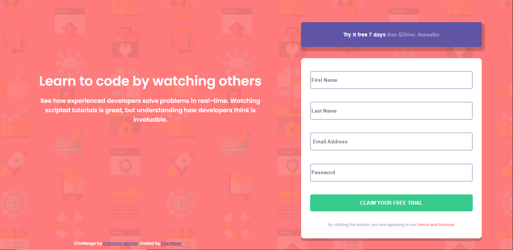
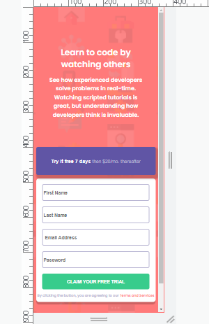

# Intro component with sign up form solution

This is my solution to the [Intro component with sign up form challenge on Frontend Mentor](https://www.frontendmentor.io/challenges/intro-component-with-signup-form-5cf91bd49edda32581d28fd1). Frontend Mentor challenges help you improve your coding skills by building realistic projects.

## Table of contents

- [Overview](#overview)
  - [The challenge](#the-challenge)
  - [Screenshot](#screenshot)
  - [Links](#links)
- [My process](#my-process)
  - [Built with](#built-with)
  - [What I learned](#what-i-learned)
  - [Continued development](#continued-development)
  - [Useful resources](#useful-resources)
- [Author](#author)
- [Acknowledgments](#acknowledgments)

## Overview

### The challenge

Users should be able to:

- View the optimal layout for the site depending on their device's screen size
- See hover states for all interactive elements on the page
- Receive an error message when the `form` is submitted if:
  - Any `input` field is empty. The message for this error should say _"[Field Name] cannot be empty"_
  - The email address is not formatted correctly (i.e. a correct email address should have this structure: `name@host.tld`). The message for this error should say _"Looks like this is not an email"_

### Screenshot

Desktop Design:



Mobile Design:



### Links

- Solution URL: [mySolution](https://purplehippo911.github.io/SignUp_form/)
- Live Site URL: [githubPages](https://your-live-site-url.com/)

## My process
First I think I started by adding the elements like the description, form and the footer. Then I went over to CSS and  added some colors, fonts and the font-size to variables in the ":root", and from there I went downwards and added the background-svg to the background, added some widhts only to take write them out later on, and etc. I got quite a lot of help from @JiriKofron's solution, click here to check out his solution ->[acknowledgements](#acknowledgements). And from there I needed to make the form validate the email and check if the input is empty, so I used webdevSimplified's video as an insight to how it works, chech out his video here --> [resources](#useful-resources). And then I removed the widths to make it a bit more responsive and somehow it worked.

### Built with

- Semantic HTML5 markup
- CSS custom properties
- Vanilla JS
- Flexbox
- Mobile-first workflow

### What I learned
I learned how to validate email and how to check if a box in a form is empty with Javascript, and I got a recap on responsive design and on using media queries. And lastly I learned some new html attrributes like "required" and "novalidate.

```html
<div class="wrong_input wrong_input4">
  <p>Password cannot be empty</p>
</div>
```

```css
.form_button {
  width: 90%;
  margin-top: 1rem;
  border: 0;
  border-radius: 5px;
  padding: 15px;
  background-color: var(--green);
  color: var(--grayBlue);
  font-weight: 600;
  text-transform: uppercase;
  box-shadow: 0px px 0px 0px hsla(5, 10%, 0%, 0.2);
  transition: 0.5s;
}
```

```js
 if(firstName.value && lastName.value && password.value  ===! "" || firstName.value && lastName.value && password.value !== null) {
       div1.classList.remove('active');
       div2.classList.remove('active');
       div4.classList.remove('active');
       firstName.classList.remove('empty');
       lastName.classList.remove('empty');
       password.classList.remove('empty');
   }
};
```

### Continued development

I think that I should start to learn a bit more about Flexbox, because positioning the elements was one of the most difficult things I had to do throughout this challenge. I also want to learn more about markdown, and how to use it properly. And lastly I should try to do more challenges including JS so that I can train on it and become more comfortable with it.

### Useful resources

- [webdevSimplified](https://m.youtube.com/watch?v=ln0nB0ABaUk) - This video gave me an insight to how to validate forms in Javascript. I think that his channel is quite beginner-friendly.

## Author

- Frontend Mentor - [@purplehippo911](https://www.frontendmentor.io/profile/purplehippo911)
- Github - [@purplehippo911](https://github.com/purplehippo911)

## Acknowledgments

I got quite a lot of inspiration from @JiriKofron. Don`t forget to check out their solution aswell.
- Github - [@JiriKofron](https://github.com/JiriKofron/intro-component-with-signup-form)

Thanks for watching my solution and happy coding!🎈🎆🍕